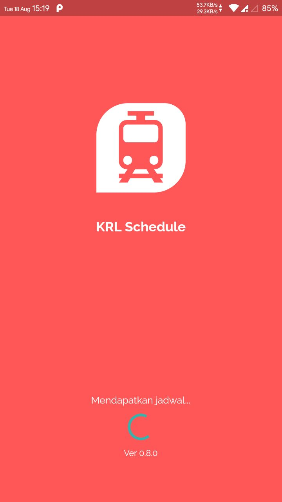
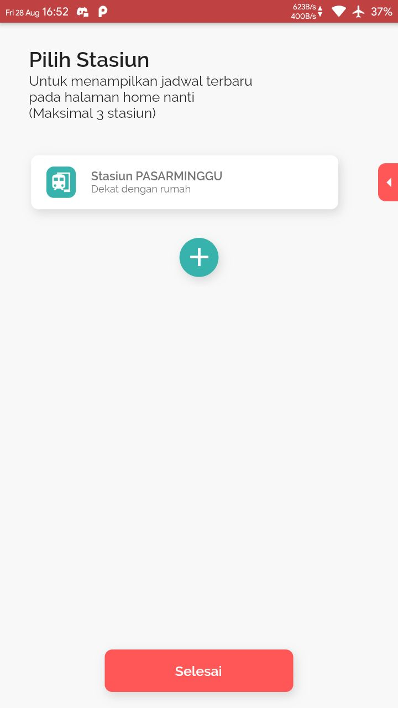
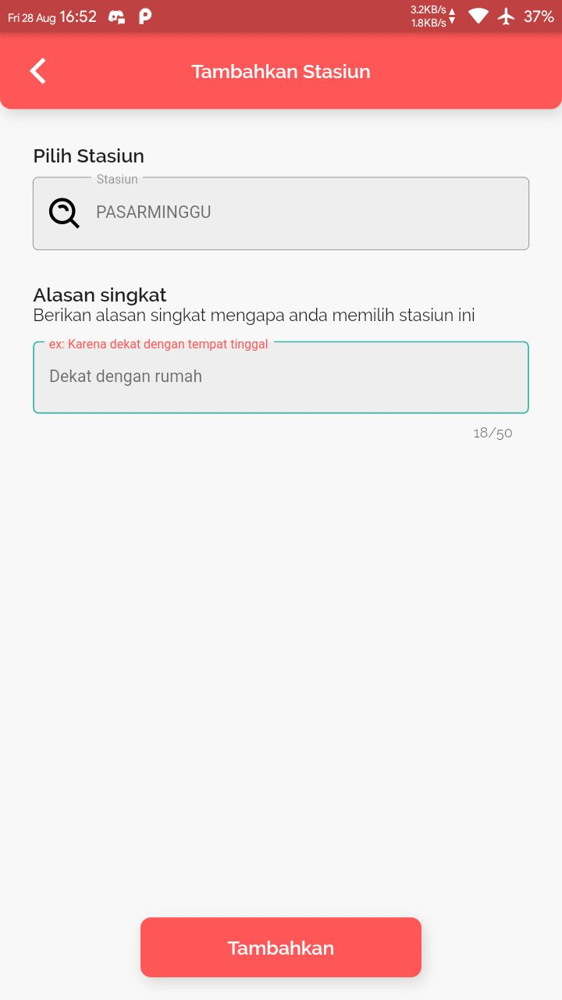
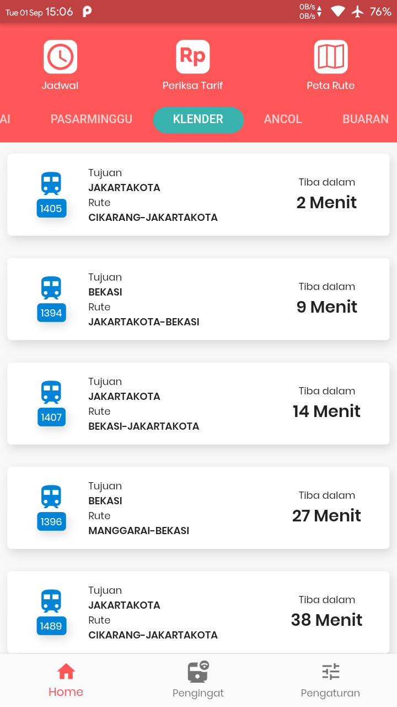
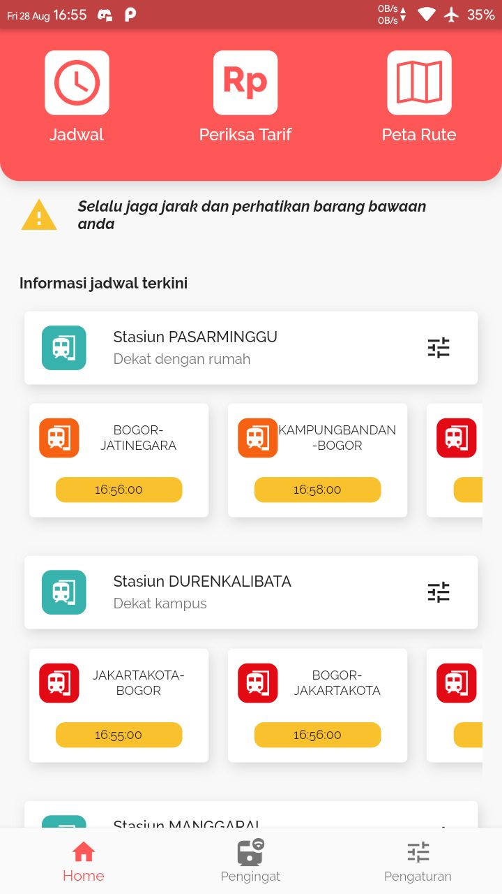

# KRL Schedule

## Features
*  User profilling
*  Check Schedule KRL

## 📸 Example Android
<pre>
    
</pre>

## 📁 Direktori
    # Root Project
    .
    ├── app                    # Setup service locator.
    |
    ├── core                   # Logic File/class.
    │   └── model              # Model class.
    │   │   └── request        # Model for request http.
    │   │   └── response       # Model for json response.
    │   └── service            # Functional like shared preference, http request, etc.
    │   └── viewmodel          # All functional logic to prossess data.
    |
    └── UI                     # UI File/class.
        ├── page               # Page/UI File/class.
        ├── shared             # Custom function, extension, etc which can be used repeatedly on each method.
        └── widget             # Custom widget which can be used repeatedly.

## 📁 Git commit format
* Add
Use when add new feature/update
* Fix
Use when fix some bug/error
* Remove
Use when remove some feature
#### Example :
    Add: Home page
    Fix: Layout not responsive
    Remove: Shadow on item list 
